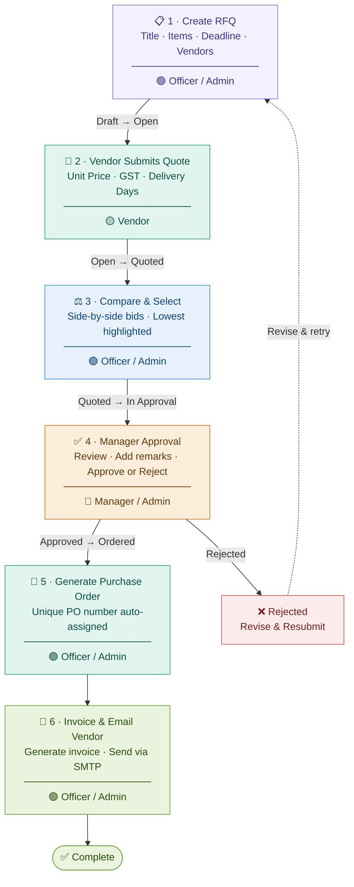

<div align="center">

# 🌉 VendorBridge ERP

### Procurement & Vendor Management ERP — built with Django


Digitises the entire procurement lifecycle — from raising an RFQ to generating invoices —
with role-based access, real-time notifications, and a premium dark/light UI.

</div>

---

## ✨ Features

| | Feature | Description |
|--|---------|-------------|
| 🔐 | **Role-Based Access** | 4 roles — Admin, Officer, Manager, Vendor — each with tailored views |
| 📋 | **RFQ Management** | Create, draft, edit and send RFQs to multiple vendors in one click |
| ⚖️ | **Quotation Comparison** | Side-by-side vendor bids with lowest-price highlighting |
| ✅ | **Approval Workflow** | Officer selects best quote → Manager approves or rejects with remarks |
| 🛒 | **Purchase Orders** | Auto-generated from approved quotations with unique PO numbers |
| 🧾 | **Invoices** | Generate invoices from POs and email them to vendors via SMTP |
| 📊 | **Dashboard & Reports** | KPIs, monthly spend trends, vendor ratings, procurement funnel |
| 🔔 | **Notifications** | In-app alerts for RFQ invitations, approvals, and status changes |
| 🕵️ | **Activity Log** | Full audit trail — who did what and when |
| 🌗 | **Dark / Light Mode** | Theme toggle with preference saved in localStorage |

---

## 👥 User Roles

| Role | Permissions |
|------|-------------|
| 🔴 **Admin** | Full access — everything an Officer and Manager can do |
| 🟢 **Procurement Officer** | Create RFQs, compare quotes, send for approval, generate POs & invoices |
| 🔵 **Manager / Approver** | Review and approve or reject procurement requests with remarks |
| 🟡 **Vendor** | View invited RFQs and submit quotations with item-wise pricing |

---

## 🔄 Procurement Workflow



| Step | Action | Actor | Status Change |
|------|--------|-------|---------------|
| **1** | Create RFQ — title, items, deadline, vendors | Officer / Admin | `Draft` → `Open` |
| **2** | Submit quotation — unit price, GST, delivery days | Vendor | `Open` → `Quoted` |
| **3** | Compare all bids side-by-side, click **Request Approval** | Officer / Admin | `Quoted` → `In Approval` |
| **4** | Review request, add remarks, **Approve** or **Reject** | Manager / Admin | `In Approval` → `Approved` |
| **5** | Generate Purchase Order — unique PO number assigned | Officer / Admin | `Approved` → `Ordered` |
| **6** | Generate invoice from PO, email it to the vendor | Officer / Admin | `Ordered` → `Invoiced` |

> ⚠️ If rejected at Step 4, the Officer revises the RFQ and re-submits for approval.

---

## 🚀 Quick Start

### Prerequisites
- Python 3.10+
- pip & Git

### Setup (SQLite — no database server needed)

**macOS / Linux**
```bash
git clone https://github.com/Krish-3010/Vendor-Bridge-ERP.git
cd Vendor-Bridge-ERP

python3 -m venv venv
source venv/bin/activate

pip install -r requirements.txt
python manage.py migrate
python manage.py seed_demo
python manage.py runserver
```

**Windows (PowerShell)**
```powershell
git clone https://github.com/Krish-3010/Vendor-Bridge-ERP.git
cd Vendor-Bridge-ERP

python -m venv venv
.\venv\Scripts\Activate

pip install -r requirements.txt
python manage.py migrate
python manage.py seed_demo
python manage.py runserver
```

Then open **[http://127.0.0.1:8000](http://127.0.0.1:8000)** in your browser.

---

## 🔑 Demo Accounts

> All accounts share the password: **`VendorBridge@123`**

| Role | Email |
|------|-------|
| 🔴 Admin | `admin@vendorbridge.local` |
| 🟢 Procurement Officer | `officer@vendorbridge.local` |
| 🔵 Manager / Approver | `manager@vendorbridge.local` |
| 🟡 Vendor (TechCore Solutions) | `vendor@vendorbridge.local` |

### Suggested Test Flow
1. **Officer** → Create a new RFQ and send it to vendors
2. **Vendor** → Submit a quotation for the open RFQ
3. **Officer** → Compare bids → click **Request Approval**
4. **Manager** → Approve or reject from the Approvals page
5. **Admin** → Generate the PO and invoice

### Seeded Demo Data

| Data | Count | Details |
|------|-------|---------|
| Vendors | 8 | Construction, IT, Logistics, Furniture, Healthcare, Marketing, Maintenance |
| RFQs | 6 | One at each pipeline stage |
| Quotations | Multiple per RFQ | Realistic item-wise pricing |
| Purchase Orders | 2 | One issued, one completed |
| Invoices | 2 | One sent, one paid |

---

## 🛠 Tech Stack

| Layer | Technology |
|-------|------------|
| **Backend** | Python 3.10+, Django 5.x |
| **Database** | SQLite *(default)* / MySQL 8.x *(production)* |
| **Frontend** | HTML5, Vanilla CSS (custom design system), Vanilla JS |
| **Fonts** | Google Fonts — Inter, JetBrains Mono |
| **Email** | Django SMTP backend (Gmail, Outlook) or console backend |
| **Auth** | Django built-in auth + custom OTP email verification |

---

## ⚙️ Optional Configuration

<details>
<summary><strong>🐬 MySQL Setup</strong></summary>

1. Create the database:
```sql
CREATE DATABASE vendorbridge CHARACTER SET utf8mb4 COLLATE utf8mb4_unicode_ci;
```

2. Copy and configure the environment file:
```bash
cp .env.example .env
```

```env
DB_ENGINE=django.db.backends.mysql
DB_NAME=vendorbridge
DB_USER=root
DB_PASSWORD=your_password
DB_HOST=127.0.0.1
DB_PORT=3306
```

3. Run migrations and seed:
```bash
python manage.py migrate
python manage.py seed_demo
python manage.py runserver
```

> If no `.env` is present, the app automatically falls back to SQLite.

</details>

<details>
<summary><strong>📬 Email / SMTP Setup</strong></summary>

By default, OTP codes and invoice emails are **printed to the terminal**. To send real emails:

```env
EMAIL_HOST=smtp.gmail.com
EMAIL_PORT=587
EMAIL_HOST_USER=your_email@gmail.com
EMAIL_HOST_PASSWORD=your_app_password
```

> Gmail requires an [App Password](https://support.google.com/accounts/answer/185833), not your regular password.

</details>

---

## 📁 Project Structure

```
Vendor-Bridge-ERP/
├── manage.py
├── requirements.txt
├── .env.example
│
├── vendorbridge/              # Django project settings
│   ├── settings.py
│   ├── urls.py
│   └── wsgi.py
│
├── procurement/               # Main app
│   ├── models.py              # RFQ, Vendor, Quotation, Approval, PO, Invoice
│   ├── views.py               # All view logic with role guards
│   ├── forms.py               # RFQ, Quotation, Signup, Profile forms
│   ├── urls.py
│   ├── context_processors.py  # Sidebar nav, notification badges
│   ├── signals.py
│   └── management/commands/
│       └── seed_demo.py       # Demo data seeder
│
├── templates/
│   ├── base.html              # Master layout (sidebar, topbar, theme toggle)
│   ├── dashboard.html
│   ├── rfqs.html / rfq_form.html
│   ├── quotations.html / compare.html
│   ├── approvals.html
│   ├── purchase_orders.html
│   ├── invoices.html
│   ├── reports.html
│   └── auth/
│       ├── login.html
│       ├── signup.html
│       └── verify_otp.html
│
└── static/
    ├── css/app.css            # Full design system (light/dark)
    └── js/app.js              # Theme toggle, charts
```

---
